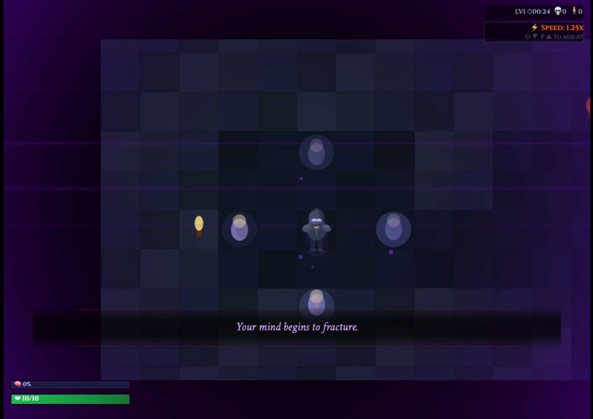
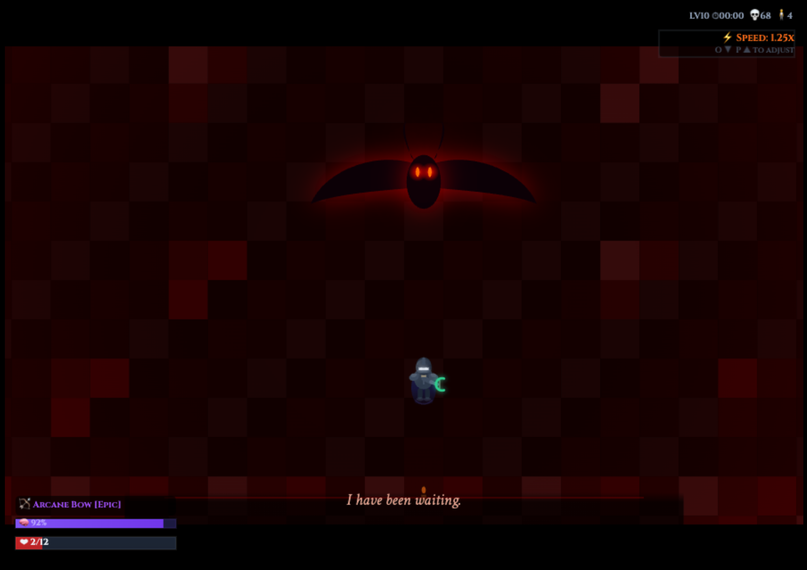

# 🏰 Dungeon Break — Abyss Edition

<p align="center">


</p>

<p align="center">

### ⚔ A Dark Fantasy Dungeon Crawler Built with Pure JavaScript

Explore procedurally generated dungeons, defeat dangerous enemies, collect relics, and face the terrifying **Abyss Warden**.

</p>

---

# 🎮 Play the Game

<p align="center">

<a href="https://pdineshsampathram-spec.github.io/dungeon-break-abyss/">

</a>

</p>

---

# ✨ Game Features

### 🗺 Procedural Dungeon Generation

Every dungeon level is randomly generated, ensuring **each run feels different**.

### ⚔ Multiple Weapon Types

Choose your combat style:

* Sword
* Axe
* Dagger
* Spear
* Arcane Bow

Each weapon has unique attack mechanics.

### 👾 Enemy Variety

Fight against multiple enemy types including:

* Skeleton Warriors
* Ghouls
* Demons
* Wraiths

Enemies become stronger as you progress deeper into the abyss.

### 👑 Boss Battle

Face the **Abyss Warden**, the ultimate guardian of the dungeon.

### 🧠 Sanity System

Your sanity affects the game outcome and can lead to **different endings**.

### 🏆 Achievement System

Unlock **20+ achievements** based on gameplay actions and secret endings.

### 📱 Mobile Support

The game includes **mobile-friendly controls** with customizable layouts.

### 🌫 Atmospheric Effects

Dynamic lighting, particles, and dungeon ambience create a dark immersive environment.

---

# 🏆 Achievements

The game includes many unlockable achievements such as:

| Achievement      | Description               |
| ---------------- | ------------------------- |
| 🩸 First Blood   | Kill your first enemy     |
| 🛡 Savior        | Rescue survivors          |
| ⚡ Speed Runner   | Finish a level quickly    |
| 🧠 Sanity Keeper | Maintain high sanity      |
| 🏹 Sharpshooter  | Kill enemies with the bow |
| 👑 Boss Slayer   | Defeat the Abyss Warden   |

Some achievements are **hidden** and tied to alternate endings.

---

# 🎮 Controls

## Desktop

```text
WASD / Arrow Keys → Move
Space             → Attack
Enter             → Confirm
Esc               → Pause
```

## Mobile

* Virtual joystick for movement
* Attack / action buttons
* Customizable control layout

---

# 📷 Screenshots

Add screenshots inside a `screenshots` folder.

Example:

```text
screenshots/gameplay.png
screenshots/boss.png
```

Then display them:

```markdown


```

---

# 🛠 Technologies Used

* **HTML5 Canvas**
* **Vanilla JavaScript**
* **Custom Game Loop**
* **Procedural Map Generation**
* **LocalStorage Save System**

No external libraries or engines were used.

---

# 📂 Project Structure

```
dungeon-break-abyss
│
├── index.html
├── README.md
└── screenshots/
    ├── gameplay.png
    └── boss.png
```

---

# 🚀 Future Improvements

Planned features:

* More enemy types
* Additional weapons
* New dungeon biomes
* More boss mechanics
* Expanded achievement system

---

# 👤 Author

**Dinesh**

Built as a personal project to explore **game development with pure JavaScript and HTML5 Canvas**.

---

# ⭐ Support

If you enjoyed the game, consider **starring the repository** ⭐
It helps the project reach more developers.

